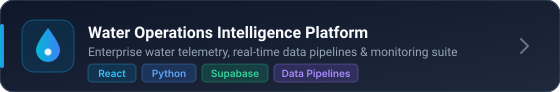
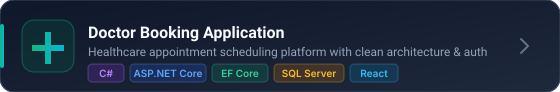
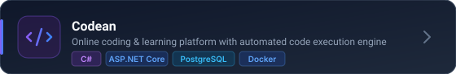

<!-- Luxury Hero Header Banner -->

 

<!-- Dynamic Terminal Typing Animation -->

  

<!-- Premium Connect Badges -->

  &nbsp;&nbsp;
  &nbsp;&nbsp;
  

---

## 👨‍💻 About Me

I'm a **.NET Backend Developer** focused on building robust, maintainable, and scalable backend applications with **C#** and **ASP.NET Core**.

I concentrate on practical software engineering: translating business requirements into reliable APIs, writing clean modular code using **Clean Architecture** and **SOLID** principles, optimizing database queries, and designing systems that are straightforward to test and scale.

- 💻 **Primary Stack:** C# · .NET 10 · ASP.NET Core · Entity Framework Core · LINQ
- 🏗️ **Architecture:** Clean Architecture · Domain-Driven Design · MediatR (CQRS) · Repository Pattern
- 🗄️ **Databases & Caching:** PostgreSQL · Microsoft SQL Server · Redis
- ⚙️ **Best Practices:** Async/await · Global Exception Handling · Structured Logging · Rate Limiting · CancellationTokens
- 🚀 **Currently Building:** Enterprise telemetry platforms · Online coding infrastructure · Clean REST APIs
- 📬 **Open to:** Backend engineering roles · Internships · Collaborative projects

---

## 🛠️ Tech Stack

 

| Category | Technologies |
| :--- | :--- |
| **Languages** | C# · SQL |
| **Frameworks** | ASP.NET Core Web API · .NET 10 · Entity Framework Core · Dapper · MediatR · SignalR |
| **Architecture** | Clean Architecture · CQRS · Repository Pattern · SOLID · Dependency Injection · Middleware Pipelines |
| **Databases** | PostgreSQL · Microsoft SQL Server · Redis Cache |
| **DevOps & Cloud** | Docker · GitHub Actions (CI/CD) · Azure · Supabase |
| **Tools** | Git · Postman · Swagger / OpenAPI · Visual Studio · Rider |

---

## 🚀 Featured Projects

  

  

  

---

## 📊 GitHub Streak

---

  💡 <i>"Clean code always looks like it was written by someone who cares."</i> — Robert C. Martin

